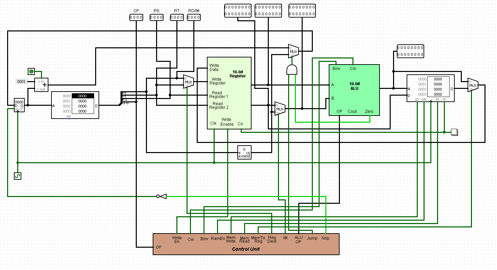

# 16bitSingleCycleProcessor

A 16-bit single cycle processor capable of performing simple arithmetic, logical, branching, and data transfer operations.

This was the course project of **Computer Architecture & Design (CSE332)** course. 

To get a better understanding, check out the [ISA](Documents/InstructionSetArchitecture.pdf).

 
*Datapath Preview*
